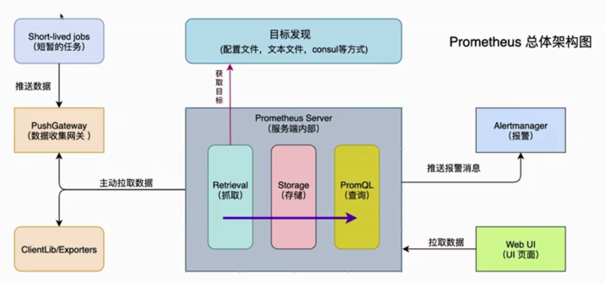

<!--
 * @Description: 
 * @Author: neozhang
 * @Date: 2022-02-09 23:23:01
 * @LastEditors: neozhang
 * @LastEditTime: 2022-02-09 23:43:05
-->
# prometheus介绍  

- 是一套开源的监控-报警-时间序列数据库的组合  
- 基本原理是通过HTTP协议周期性抓取被监控组件的状态  
- 适合Docker、K8s环境的监控系统  

## 架构图  

  

## 重要组件  

- Prometheus Server：用于收集和存储时间序列数据  
- Client Library：客户端生成相应的metrics并暴露给Prometheus Server  
- Push Gateway：主要用于短期的jobs  
- Exporters：用于暴露已有的第三方服务的metrics给Prometheus  
- Alertmanager：从Prometheus Server端接收到alerts后，会进行去除重复，分组，并路由到对收的接收方式，发出报警  

## 工作流程  

- Prometheus server定期从配置好的jobs/exporters/Pushgateway中拉数据  
- Prometheus server记录数据并且根据报警规则推送alert数据  
- Alertmanager根据配置文件，对接收到的警报进行处理，发送告警。  
- 在图形界面中，可视化采集数据。  

## 相关概念-数据模型  

- Prometheus中的存储的数据为时间序列  
- 格式上由metric的名字和一系列标签（键值对）唯一标识组成  
- 不同的标签代表不同的时间序列  

## 相关概念-metric（指标）类型  

- Counter类型：一种累加的指标，如：请求的个数，出现的错误数等  
- Gauge类型：可以任意加减，如：温度，运行的协程的个数  
- Histogram类型：可以对观察结果采样，分组及统计，如：柱状图  
- Summary类型：提供观测值的count和sum功能，如：请求持续时间  

## 相关概念-instance和jobs  

- instance：一个单独监控的目标，一般对应于一个进程  
- jobs：一组同种类型的instances（主要用于保证可扩展性和可靠性）  

