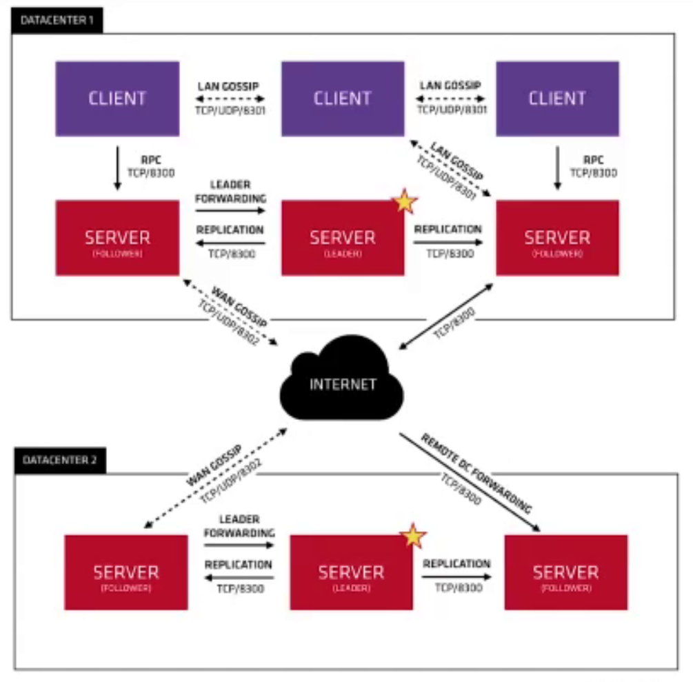

<!--
 * @Description: 
 * @Author: neozhang
 * @Date: 2022-02-09 22:46:45
 * @LastEditors: neozhang
 * @LastEditTime: 2022-03-07 22:11:34
-->
# 注册中心原理  

## Consul基本介绍  

- 是一种服务网络解决方案  
- 提供具有服务发现，配置和分段功能的全功能控制平面  
- 附带一个简单的内置代理，开箱即用  

## Consul关键功能  

- 服务发现：客户端可以注册服务  
- 运行状况检查：
- KV存储：应用程序可以将Consul的层级键/值存储用于任何目的，包括动态配置，功能标记，协调，领导者选举等  
- 安全服务通信：可以为服务生成和分发TLS证书，建立相互的TLS连接  
- 多数据中心：华为云-阿里云-腾讯云 -> Consul  

## Consul集群架构  

  

## Consul两个重要协议  

### Gossip Protocol（八卦协议）  

局域网池（LAN Pool）  
让client自动发现server节点，减少所需的配置量  
分布式故障检测在某几个server机器上执行
能够用来快速的广播事件  

广域网池（WAN Pool）  
WAN Pool全局唯一  
不同数据中心的Server都会加入WAN Pool  
允许服务器执行跨数据中心请求  

### Raft Protocol（选举协议）  

## 注册中心Consul主要特性  

- 服务发现  
- 健康检查  
- 键值对存储  